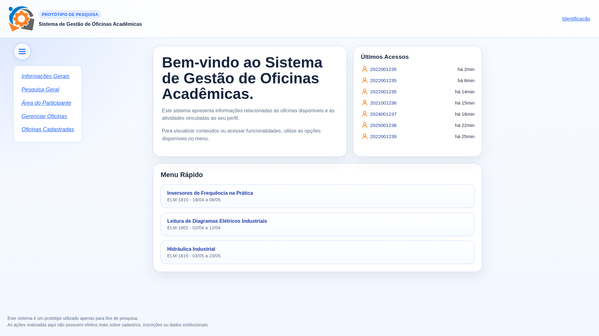
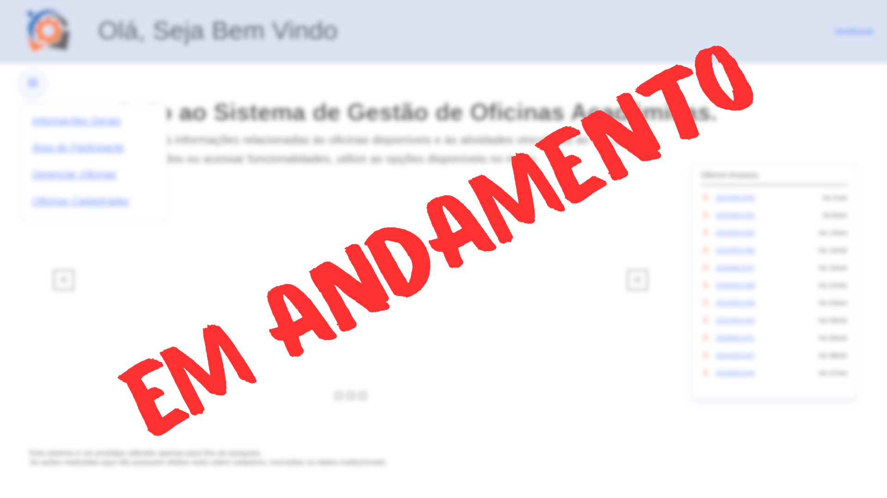

# Protótipo de TCC para Avaliação de Usabilidade

Este repositório reúne um protótipo experimental desenvolvido para um Trabalho de Conclusão de Curso (TCC) com foco em usabilidade. A proposta central é comparar duas versões de uma mesma aplicação, mantendo a lógica funcional equivalente e variando principalmente a experiência de uso.

## Sobre o projeto

O sistema simula um ambiente de gestão de oficinas acadêmicas. Dentro dele, participantes podem navegar por telas, consultar oficinas, interagir com fluxos de inscrição e executar tarefas definidas para a pesquisa.

A comparação acontece entre duas interfaces:
- `v1`: versão deliberadamente mais confusa e com mais fricção
- `v2`: versão pensada para ser mais clara, previsível e usável

As duas interfaces mantêm o mesmo objetivo funcional. O que muda é a forma como as informações e interações são apresentadas ao usuário.

## Objetivo do experimento

O experimento busca observar como diferentes decisões de interface influenciam a experiência de uso. Entre os pontos de interesse estão:
- desempenho na execução das tarefas
- caminho de navegação entre telas
- dificuldade percebida ao localizar ações e informações
- diferença de comportamento entre uma interface pior e uma interface melhor

Além da observação da interação, o sistema já possui instrumentação para coleta de métricas que apoiam a análise posterior.

## Como o projeto está organizado

O protótipo foi estruturado para permitir que as duas interfaces coexistam no mesmo projeto sem compartilhar a camada visual.

- `v1/` e `v2/` contêm as entradas independentes das duas interfaces
- `src/common/` concentra dados mockados, estado, lógica funcional, métricas e exportação
- `src/v1/` e `src/v2/` concentram comportamento de interface, renderização e estilos específicos

O projeto utiliza HTML, CSS e JavaScript puro, sem framework e sem build tool.

## Interface v1

A `v1` representa a versão ruim dentro do experimento. Nela, certas escolhas de organização, busca, destaque visual e leitura podem ser propositalmente menos claras. O objetivo não é oferecer a melhor experiência, e sim criar uma condição comparativa controlada para observar como a interface afeta o comportamento do usuário.

## Interface v2

A `v2` representa a versão boa da interface. Ela busca maior clareza visual, melhor hierarquia de informação e uma navegação mais compreensível, mantendo o mesmo fluxo funcional da `v1`.

## Métricas coletadas

O sistema já registra automaticamente algumas métricas relevantes para a pesquisa:
- tempo de sessão
- número de cliques
- número de erros
- caminho de navegação
- mouse tracking

As respostas ao questionário UMUX não fazem parte da coleta automatizada dentro do sistema e são tratadas separadamente.

## Como visualizar o protótipo

Para abrir as interfaces, basta acessar os arquivos HTML correspondentes:

- `v1/index.html`
- `v2/index.html`

A raiz do projeto também pode servir como ponto de entrada para navegação entre as versões, dependendo do fluxo adotado durante a aplicação do experimento.
